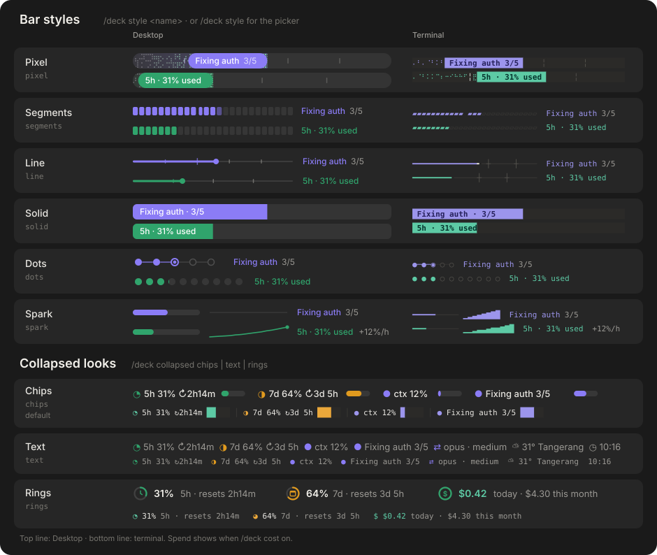

<p align="center">
  
</p>

<p align="center">
  <a href="https://github.com/nvr0x5/claude-deck/actions/workflows/test.yml"></a>
  <a href="LICENSE"></a>
  
  
  <a href="#model-routing"></a>
</p>

<p align="center">
  <b>See what Claude is doing, what it costs you, and when your limits reset, without leaving the prompt.</b>
</p>

<p align="center">
  <a href="#install">Install</a> ·
  <a href="#what-you-get">What you get</a> ·
  <a href="#styles">Styles</a> ·
  <a href="#the-pet">The pet</a> ·
  <a href="#commands">Commands</a> ·
  <a href="#model-routing">Model routing</a> ·
  <a href="#credits">Credits</a>
</p>

---

**Deck** is a Claude Code mod. It draws a small, collapsible panel in the band above your prompt, in the terminal and in the Desktop app, and keeps it live while Claude works. It only watches and draws: it never blocks a tool call, changes a request, or adds tokens to your conversation.

It pairs with **[jev-model-router](#model-routing)**: when the router picks a model and effort for a prompt or a subagent, Deck shows the decision live, with its confidence, so routing stops being invisible.

- **Claude Code Desktop and CLI.** The same mod runs in the Desktop app's Code tab and in the terminal, each drawn natively: animated SVG on Desktop, colored text and pictures in the terminal.
- **Your limits, always on screen.** 5h and 7d usage with live reset countdowns and burn rates, no `/usage` needed.
- **Live progress.** Plan bars, an activity bar for any task, and subagent strips with the model each one got.
- **Six bar styles, three collapsed looks.** Pixel, segments, line, solid, dots and spark; chips, text and rings. Pick yours with `/deck style`; see them all in [Styles](#styles).
- **A tiny pet** that plays while Claude works and raises a **!** when Claude needs you.

<p align="center">
  
</p>

<p align="center">
  
</p>

## Install

In Claude Code:

```
/plugin marketplace add nvr0x5/claude-deck
/plugin install deck@deck
```

Then run `/deck demo` to see it. In a fresh session the demo fills in a sample model route and sample limits until the real ones arrive.

**VS Code:** the Claude Code extension's chat panel runs `/deck` commands but doesn't draw a mod's band or panels yet (checked with extension 2.1.294). Turn on the extension's `Claude Code: Use Terminal` setting, or run `claude` in VS Code's terminal, and you get the full Deck; the pet needs a terminal that shows images.

Mods need Claude Code 2.1.286 or later. To try it from a clone without installing, run `claude --plugin-dir ./claude-deck`.

## What you get

| Row | What it shows | Where it comes from |
|---|---|---|
| **Plan bar** | Steps, the current step, stage lines | Claude's todo list, task tools, or a plan you approve in plan mode |
| **Activity bar** | What Claude is doing right now (`Editing auth.ts · 14 tools · 1m 12s`) | Any turn without a todo list |
| **Agent strips** | Each subagent's current tool, its model, elapsed time | Subagents, under the bar that started them |
| **Context** | Tokens used out of the window | Your session |
| **5h and 7d limits** | Percent used, a live countdown to each reset, and how fast you're burning it (`+12%/h`) | Your plan's rate limits, no `/usage` needed |
| **Spend** (optional) | What you've spent today and this month | Your session cost, added up across sessions. Turn on with `/deck cost on`; it matters on a pay-per-use API key |
| **Model route** | Which model and effort a router picked, and how sure it was | [jev-model-router](#model-routing), if installed |
| **Clock and weather** | Local time and the weather where you are | Open-Meteo, no key |

When something needs you (a permission prompt, a question, a reply ending in `?`), its row turns amber, a collapsed Deck opens by itself, and a soft alert plays. Steps tick, finished bars chime, and the last one plays a little fanfare.

**Collapsed**, Deck is one line ordered by what matters: anything waiting on you, then your **5h and 7d limits**, context, the current task, and the route. Pick its look:

- `/deck collapsed chips`: chips with mini bars (the default)
- `/deck collapsed text`: one plain status line, with the clock and weather at its end
- `/deck collapsed rings`: a ring per limit with its reset time, plus spend: `◔ 14% 5h · resets 1h7m   ◕ 83% 7d · resets 3h47m   $ $0.10 today · $4.30 mo`

## Styles

Pick how the bars look with `/deck style`, a picker with live previews. Each app (Desktop and terminal) keeps its own choice.

<p align="center">
  
</p>

| Style | CLI | Desktop |
|---|---|---|
| Pixel | braille dots and a colored pill | twinkling pixels and a gliding pill |
| Segments | `▰▰▰▰▱▱▱` | rounded blocks |
| Line | `━━━━╸────` | thin line with a pulsing head |
| Solid | filled bar with the text inside | filled bar with a light sweep |
| Dots | `●─●─◉┄○` one per step | step dots |
| Spark | slim bar and a `▁▂▃▅▇` history of the last hour | slim bar and a live sparkline, with the burn rate |

## The pet

A tiny Claude walks along Deck's header line (in its own strip above the panel with `/deck size roomy`, and always in the terminal). It wanders, runs, jumps and naps when you're idle, plays a console while Claude works, raises a **!** when something needs you, and celebrates when a bar finishes.

On Desktop it's an animated SVG. In the terminal it's drawn as a picture, so it needs a terminal that shows images: Ghostty, Kitty, WezTerm or iTerm2. Elsewhere it simply stays hidden. `/deck pet off` sends it home.

## Commands

| Command | What it does |
|---|---|
| `/deck`, `0` in an empty prompt, or the **Deck** footer button | Collapse or expand |
| `/deck style` | Style picker with live previews (keys 1–6) |
| `/deck style <name>` | `segments`, `line`, `solid`, `dots`, `pixel`, `spark` |
| `/deck <section> on\|off` | `plans agents context limits route pet clock weather all` |
| `/deck city <name>` | Weather city |
| `/deck panel [off]` | Open Deck in a panel of its own, always expanded |
| `/deck version` | Show which Deck version is running |
| `/deck size compact\|roomy` | Row spacing on Desktop (compact is the default) |
| `/deck collapsed chips\|text\|rings` | Collapsed look: chips with mini bars, one plain line, or limit rings |
| `/deck cost on\|off` | Track spend today and this month |
| `/deck auto on\|off` | Open by itself when something needs you |
| `/deck sound on\|off` | Sounds |
| `/deck quiet on\|off` | Hide the router's own lines while Deck shows the route |
| `/deck demo` | A sample plan with two agents (plus a sample route and limits until real ones arrive) |
| `/deck clear` | Remove all bars |
| `/deck status` | Everything Deck shows, as text |

Settings are saved and shared by every session on your machine.

## Model routing

Deck works on its own, and it's better with **[jev-model-router](https://github.com/davila7/claude-code-templates/tree/main/cli-tool/components/mods/productivity/jev-model-router)** by Daniel Ávila (MIT, part of claude-code-templates). The router uses Jev, TypeSafe's decision model, to pick each subagent's model and each prompt's reasoning effort. Deck shows what it decided.

| Where | What Deck shows |
|---|---|
| **Model route** row | Your model → the one the router picked (haiku, sonnet or opus), the effort, the confidence, a risk flag, how long the decision took, and the last eight decisions as squares: filled when the router switched the model, outlined when Jev only suggested it. "↓ cheaper" or "↑ deeper" appears only when the model really changed |
| **Agent strips** | The model each subagent was given, as a haiku, sonnet or opus tag |
| **Collapsed line** | `⇄ opus · medium`, the current route at a glance |

Deck only reads the router's output; routing is the router's job, and Deck never changes a request itself. Deck keeps the router's own status and log lines out of the transcript while it shows them as a row; `/deck quiet off` brings them back.

**Add the router.** Install it in a project with claude-code-templates:

```bash
npx claude-code-templates@latest --mod productivity/jev-model-router
```

Or load it in every session and keep it up to date on its own. Check out just the router's folder:

```bash
git clone --depth 1 --filter=blob:none --sparse https://github.com/davila7/claude-code-templates.git ~/mods/claude-code-templates
git -C ~/mods/claude-code-templates sparse-checkout set cli-tool/components/mods/productivity/jev-model-router
```

Then, in `~/.claude/settings.json`, point `CLAUDE_CODE_PLUGIN_DIRS` at it and add a `SessionStart` hook that pulls updates in the background each time Claude Code starts (replace `/Users/you` with your home folder):

```json
"env": {
  "CLAUDE_CODE_PLUGIN_DIRS": "/Users/you/mods/claude-code-templates/cli-tool/components/mods/productivity/jev-model-router"
},
"hooks": {
  "SessionStart": [
    { "hooks": [{ "type": "command", "command": "(git -C ~/mods/claude-code-templates pull -q --ff-only >/dev/null 2>&1 &) ; exit 0" }] }
  ]
}
```

An update pulled at startup takes effect from the next session. Auto-updating runs new upstream code without you reviewing it; leave the hook out and run the `git pull` yourself if you'd rather check first.

With no key, the router uses Claude Code's built-in classifier and nothing leaves your machine. For a calibrated confidence, add a TypeSafe key in `~/.claude/settings.json`. The entry's name depends on how the router is loaded: `jev-model-router@skills-dir` for the `npx` install, `jev-model-router@inline` for a folder in `CLAUDE_CODE_PLUGIN_DIRS`.

```json
"pluginConfigs": {
  "jev-model-router@inline": { "options": { "provider": "typesafe", "typesafeApiKey": "YOUR_KEY" } }
}
```

With a key, prompt text goes to TypeSafe. Run `/deck quiet off` and look for `ready on typesafe` to confirm the key was picked up. See the [router's README](https://github.com/davila7/claude-code-templates/tree/main/cli-tool/components/mods/productivity/jev-model-router) for its options, such as routing the main model too.

If the router gets no answer (out of credit, a bad key, or slower than its 800 ms limit), it leaves the model as it is, and the route row says so in amber, e.g. `kept opus · ! typesafe 402`. After three misses in a row it adds a hint to check the key or credit.

## Updating

`/plugin` → **Installed** → **Deck** → update. See [CHANGELOG.md](CHANGELOG.md) for what changed.

## Privacy

Deck makes two kinds of network request, both to Open-Meteo and only when you set a city: one to look the city up, then the forecast every 20 minutes. Nothing about your prompts or code leaves your machine.

## Develop

```bash
claude plugin validate ./claude-deck
cd claude-deck && claude plugin test
node assets/make-banner.mjs && node assets/make-demo.mjs && node assets/make-styles.mjs && node assets/make-social.mjs
```

The banner, the demos, the styles gallery and the social card are generated from the mod's own drawing code, so they always match what Deck really draws.

## Credits

- The desktop pixel bar, gliding pill, agent strips and plan parsing adapt [plan-progress](https://github.com/zycck/claude-mods) by Kirill Serditov (MIT, see [THIRD_PARTY_NOTICES.md](THIRD_PARTY_NOTICES.md)).
- The model route row and the agent model tags read [jev-model-router](https://github.com/davila7/claude-code-templates/tree/main/cli-tool/components/mods/productivity/jev-model-router) by Daniel Ávila (MIT), built on TypeSafe's Jev.
- The README layout takes its cue from [jev-pilot](https://github.com/Akramovic1/jev-pilot).

Deck is an independent project, not made or endorsed by Anthropic.

## License

[MIT](LICENSE)
