<p align="center">
  
</p>

<p align="center">
  
  <a href="LICENSE"></a>
  
  
</p>

<p align="center">
  <b>See what Claude is doing, what it costs you, and when your limits reset, without leaving the prompt.</b>
</p>

<p align="center">
  <a href="#install">Install</a> ·
  <a href="#what-you-get">What you get</a> ·
  <a href="#the-pet">The pet</a> ·
  <a href="#commands">Commands</a> ·
  <a href="#model-routing">Model routing</a> ·
  <a href="#credits">Credits</a>
</p>

---

**Deck** is a Claude Code mod. It draws a small, collapsible panel in the band above your prompt, in the terminal and in the Desktop app, and keeps it live while Claude works. It only watches and draws: it never blocks a tool call, changes a request, or adds tokens to your conversation.

<p align="center">
  
</p>

## Install

In Claude Code:

```
/plugin marketplace add nvr0x5/claude-deck
/plugin install deck@deck
```

Then run `/deck demo` to see it.

Mods need Claude Code 2.1.286 or later. To try it from a clone without installing, run `claude --plugin-dir ./claude-deck`.

## What you get

| Row | What it shows | Where it comes from |
|---|---|---|
| **Plan bar** | Steps, the current step, stage lines | Claude's todo list, task tools, or a plan you approve in plan mode |
| **Activity bar** | What Claude is doing right now (`Editing auth.ts · 14 tools · 1m 12s`) | Any turn without a todo list |
| **Agent strips** | Each subagent's current tool, its model, elapsed time | Subagents, under the bar that started them |
| **Context** | Tokens used out of the window | Your session |
| **5h and 7d limits** | Percent used and a live countdown to each reset | Your plan's rate limits, no `/usage` needed |
| **Model route** | Which model and effort a router picked, and how sure it was | [jev-model-router](#model-routing), if installed |
| **Clock and weather** | Local time and the weather where you are | Open-Meteo, no key |

When something needs you (a permission prompt, a question, a reply ending in `?`), its row turns amber, a collapsed Deck opens by itself, and a soft alert plays. Steps tick, finished bars chime, and the last one plays a little fanfare.

**Collapsed**, Deck is one line ordered by what matters: anything waiting on you, then your **5h and 7d limits**, context, the current task, and the route.

**Styles.** Pick how the bars look with `/deck style`, a picker with live previews. Each app keeps its own choice.

| Style | CLI | Desktop |
|---|---|---|
| Pixel | braille dots and a colored pill | twinkling pixels and a gliding pill |
| Segments | `▰▰▰▰▱▱▱` | rounded blocks |
| Line | `━━━━╸────` | thin line with a pulsing head |
| Solid | filled bar with the text inside | filled bar with a light sweep |
| Dots | `●─●─◉┄○` one per step | step dots |

## The pet

A tiny Claude lives above the panel. It wanders, runs, jumps and naps when you're idle, plays a console while Claude works, raises a **!** when something needs you, and celebrates when a bar finishes.

On Desktop it's an animated SVG. In the terminal it's drawn as a picture, so it needs a terminal that shows images: Ghostty, Kitty, WezTerm or iTerm2. Elsewhere it simply stays hidden. `/deck pet off` sends it home.

## Commands

| Command | What it does |
|---|---|
| `/deck`, `0` in an empty prompt, or the **Deck** footer button | Collapse or expand |
| `/deck style` | Style picker with live previews (keys 1–5) |
| `/deck style <name>` | `segments`, `line`, `solid`, `dots`, `pixel` |
| `/deck <section> on\|off` | `plans agents context limits route pet clock weather all` |
| `/deck city <name>` | Weather city |
| `/deck auto on\|off` | Open by itself when something needs you |
| `/deck sound on\|off` | Sounds |
| `/deck quiet on\|off` | Hide the router's own lines while Deck shows the route |
| `/deck demo` | A sample plan with two agents |
| `/deck clear` | Remove all bars |
| `/deck status` | Everything Deck shows, as text |

Settings are saved and shared by every session on your machine.

## Model routing

Deck shows routing; it doesn't route. Pair it with [jev-model-router](https://github.com/davila7/claude-code-templates/tree/main/cli-tool/components/mods/productivity/jev-model-router) (MIT), which picks each subagent's model and each prompt's effort. Deck reads its decisions and draws them as the **Model route** row: your model → the routed one, the effort, the confidence, a risk flag, and the last eight decisions.

## Privacy

Deck makes two kinds of network request, both to Open-Meteo and only when you set a city: one to look the city up, then the forecast every 20 minutes. Nothing about your prompts or code leaves your machine.

## Develop

```bash
claude plugin validate ./claude-deck
cd claude-deck && claude plugin test
node assets/make-banner.mjs && node assets/make-demo.mjs && node assets/make-social.mjs
```

The banner, the demo and the social card are generated from the mod's own drawing code, so they always match what Deck really draws.

## Credits

- The desktop pixel bar, gliding pill, agent strips and plan parsing adapt [plan-progress](https://github.com/zycck/claude-mods) by Kirill Serditov (MIT).
- The model route row reads [jev-model-router](https://github.com/davila7/claude-code-templates/tree/main/cli-tool/components/mods/productivity/jev-model-router) by Daniel Ávila (MIT).
- The README layout takes its cue from [jev-pilot](https://github.com/Akramovic1/jev-pilot).

Deck is an independent project, not made or endorsed by Anthropic.

## License

[MIT](LICENSE)
